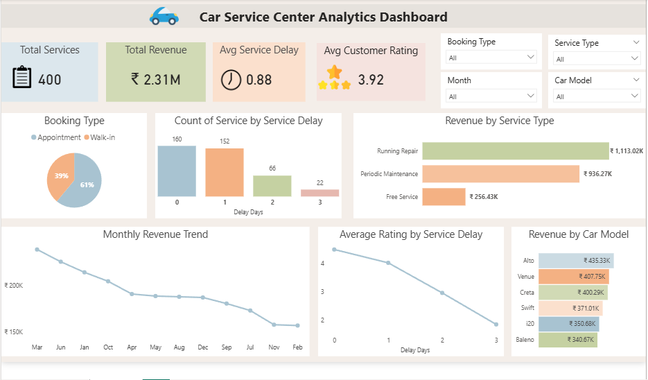

# 🚗 Car Service Center Analytics Dashboard

## 📌 Project Overview
This project analyzes a car service center’s operations to understand service patterns, revenue trends, customer satisfaction, and appointment efficiency.

---

## 🎯 Objectives
- Analyze **appointment vs walk-in trends**
- Evaluate **service delays and on-time delivery**
- Understand **revenue contribution by service type and car model**
- Study impact of **service delay on customer satisfaction**
- Identify opportunities to **increase revenue and efficiency**

---

## 🛠 Tools & Technologies Used
- **SQL** → Data cleaning and validation  
- **Python (Pandas, Matplotlib)** → Data analysis  
- **Power BI** → Dashboard creation and visualization  

---

## 📂 Dataset Description
The dataset includes:
- Customer ID
- Car Model
- Service Type (Free Service, Periodic Maintenance, Running Repair)
- Booking Type (Appointment / Walk-in)
- Appointment Date
- Service Date
- Delivery Date
- Service Delay (Days)
- Service Cost
- Customer Rating

---

## 🔄 Project Workflow

### Data Cleaning & Analysis(SQL, Python)
- Removed duplicates  
- Checked for missing values  
- Standardized service types and booking types  
- Analyzed delay vs rating relationship  
- Revenue distribution by service type  
- Booking trends (appointment vs walk-in)  

### Data Visualization (Power BI)
Created an interactive dashboard with:
- Cards 
- Charts 

---

## 📊 Key Insights
- 🚶 Walk-ins still account for a significant portion → indicates inconsistent appointment system  
- 💰 Running Repair generates highest revenue  
- ⏱ Service delay negatively impacts customer ratings  
- 🚗 Certain car models contribute more to revenue  
- 🔁 Repeat repairs may indicate quality/service issues  

---

## 🚀 Business Recommendations
- Improve **appointment scheduling system**  
- Reduce **service delays** to increase customer satisfaction  
- Focus on **high-revenue services**  
- Monitor repeat repairs for quality improvement  

---

## 📸 Dashboard Preview

---

## 🙌 Conclusion
This project helped in understanding real-world business problems and applying data analytics tools to derive meaningful insights. 

---

## 🔗 Author
**Ruthra** (https://github.com/Ruthra2198)
**Project Link** (https://github.com/Ruthra2198/car_service_center_analytics)
